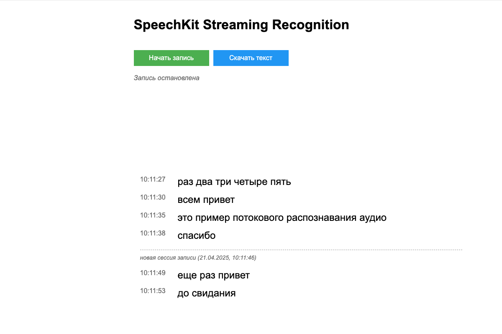

# SpeechKit Stream Recognizer


<br><br>

Этот скрипт приведен для демонстрации потокового распознавания.

Скрипт записывает голос через микрофон и передает его на распознавание в сервис [SpeechKit](https://yandex.cloud/ru/services/speechkit), результат распознавания выводится в веб-консоль.

Скрипт написан на Python поэтому может быть легко доработан и оптимизирован под ваш сценарий.
Скрипт использует WebSockets для передачи данных между клиентом и сервером.

<br><br>

## Установка и использование


1) Необходимо [создать сервисную учетную запись](https://yandex.cloud/ru/docs/iam/operations/sa/create), а также – [назначить роль](https://yandex.cloud/ru/docs/iam/operations/sa/assign-role-for-sa) `ai.speechkit-stt.user`. 

2) Для созданной сервисной учетной записи необходимо получить [API-ключ](https://yandex.cloud/ru/docs/iam/operations/authentication/manage-api-keys#create-api-key), его секрет потребуется для запуска скрипта.

3) Склонируйте текущий репозиторий

4) Установите зависимости:
```
pip install -r src/requirements.txt
```
5) Запустите скрипт:
```
python src/web_app.py --api-key <API_KEY> --port 8080
```
6) Перейдите на страницу `http://localhost:8080`

Либо, можно использовать готовый образ:

```
docker run -p 8080:8080 --env API_KEY=<API_KEY> cr.yandex/sol/ml-ai/speechkit-stream/speechkit-stream:v1.0.0
```

После запуска контейнера, также необходимо перейти на страницу `http://localhost:8080`.
