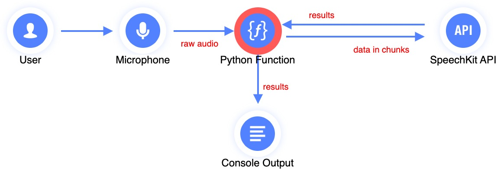
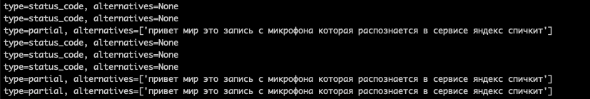

# SpeechKit Streaming Recognizer


<br><br>

This script is intended to demonstrate streaming recognition.

It records the voice through the microphone and sends the recording to [SpeechKit](https://yandex.cloud/services/speechkit) for recognition, printing the result in the console.

Written in Python, it can be easily customized and optimized for your specific use case.

<br><br>

## Installation

You can clone the current repository and go to the `cloud_api/output` folder where the `test.py` script already exists.

All you need to do is install the dependencies by running this command:

```
pip install -r requirements.txt
```

Alternatively, you can prepare the runtime environment yourself:

1. Clone the [Yandex Cloud API](https://github.com/yandex-cloud/cloudapi) repository:

```
git clone https://github.com/yandex-cloud/cloudapi
```

1. Install the `grpcio-tools` package:

```
pip install grpcio-tools
```

1. Go to the directory hosting the cloned Yandex Cloud API repository, create the `output` directory, and generate the client interface code there:

```
cd <path_to_cloudapi_directory>
mkdir output
python -m grpc_tools.protoc -I . -I third_party/googleapis \
  --python_out=output \
  --grpc_python_out=output \
    google/api/http.proto \
    google/api/annotations.proto \
    yandex/cloud/api/operation.proto \
    google/rpc/status.proto \
    yandex/cloud/operation/operation.proto \
    yandex/cloud/ai/stt/v3/stt_service.proto \
    yandex/cloud/ai/stt/v3/stt.proto
```

This will create, in your `output` directory, the client interface files (`stt_pb2.py`, `stt_pb2_grpc.py`, `stt_service_pb2.py`, and `stt_service_pb2_grpc.py`) as well as dependency files.

1. Copy `cloudapi/output/test.py` from the current repository to your `output` directory.

1. Install the dependencies:

```
pip install pyaudio
```

## Usage

1. [Create a service account](https://yandex.cloud/docs/iam/operations/sa/create) and [assign the `ai.speechkit-stt.user` role](https://yandex.cloud/docs/iam/operations/sa/assign-role-for-sa) to it. 

1. For the created service account, you will need an [API key](https://yandex.cloud/docs/iam/operations/api-key/create): without its secret, the script will not run.

1. Run `test.py`, providing the API key secret as an argument:

```
python3 test.py --secret AQVNwRHSFFJJoLPQWMPxxxxxxxxxxxxxxxxxxxxxx
```

1. As you speak to the microphone, the console screen should display the recognition result:



